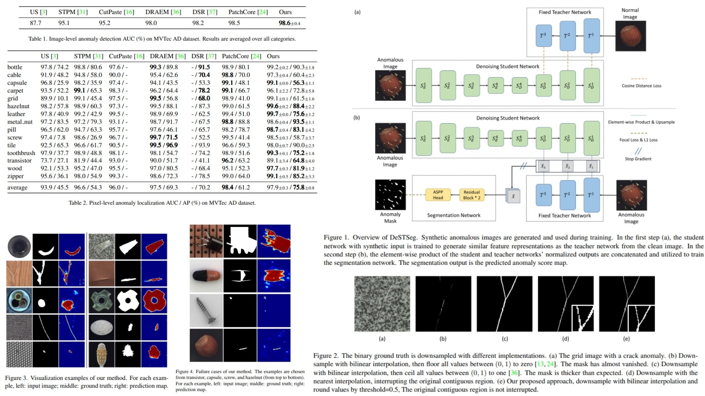

# 🔊 DeSTSeg-Replication — Denoising Student-Teacher Segmentation for Anomaly Detection

This repository provides a **faithful Python replication** of the **DeSTSeg framework** for pixel-level anomaly detection and segmentation.  
The aim is to **reproduce the model, math, and block diagram from the paper** without full-scale training.

Highlights:

* **Pixel-wise anomaly detection & segmentation** via denoising student-teacher distillation 🌌  
* Teacher is a **pretrained ResNet18**, frozen for stable guidance 🛡️  
* Student encoder-decoder learns to **denoise and match teacher features**, emphasizing anomaly discrepancies ✨  
* Segmentation network fuses multi-level differences to produce anomaly masks $$\hat{Y}$$ 🖌️  

Paper reference: *[DeSTSeg: Segmentation Guided Denoising Student-Teacher for Anomaly Detection](https://arxiv.org/abs/2211.11317)*  

---

## Overview 🎨



> The pipeline trains a **denoising student encoder-decoder** to mimic the feature representations of a **fixed teacher network** on clean images while taking synthetically corrupted inputs.  
> Multi-level differences are fused via a **segmentation network** to produce **pixel-level anomaly maps**.

Key points:

* **Teacher (T)**: pretrained ResNet18, features from conv2, conv3, conv4 🌊  
* **Student encoder-decoder (S)**: reconstructs teacher features from anomalous inputs ⚡  
* **Segmentation network**: two residual blocks + ASPP head for adaptive fusion 🏗️  
* **Input**: synthetic anomalous images $$I_a$$  
* **Output**: anomaly map $$\hat{Y}$$; high values indicate anomalous pixels  
* **Image-level score**: mean of top-T pixel values in $$\hat{Y}$$  

---

## Core Math 🧮

**Synthetic anomaly generation**:

$$
I_a = \beta (M \odot A) + (1-\beta)(M \odot I_n) + (1-M)\odot I_n
$$

- $$I_n$$ = normal image  
- $$A$$ = arbitrary image for anomaly content  
- $$M$$ = binary anomaly mask from Perlin noise  
- $$\beta \in [0.15, 1.0]$$ = blending factor  

**Cosine distance loss** (student vs. teacher at level $$k$$):

$$
X_k(i,j) = \frac{F_{T_k}(i,j) \odot F_{S_k}(i,j)}{\| F_{T_k}(i,j)\|_2 \, \| F_{S_k}(i,j)\|_2}
$$

$$
D_k(i,j) = 1 - \sum_{c=1}^{C_k} X_k(i,j)_c
$$

$$
L_{cos} = \sum_{k=1}^{3} \frac{1}{H_k W_k} \sum_{i,j} D_k(i,j)
$$

**Segmentation loss** (focal + L1):

$$
L_{focal} = -\frac{1}{H_1 W_1} \sum_{i,j} (1 - p_{ij})^\gamma \log(p_{ij})
$$

$$
L_{l1} = \frac{1}{H_1 W_1} \sum_{i,j} |M_{ij} - \hat{Y}_{ij}|
$$

$$
L_{seg} = L_{focal} + L_{l1}
$$

---

## Why DeSTSeg Matters 🌟

* Learns **robust anomaly representations** by denoising corrupted inputs 🔮  
* Student-teacher discrepancy highlights **anomalous pixels** even without real anomalies in training 🌌  
* Modular: teacher, student, segmentation network can be swapped or extended 🔧  

---

## Repository Structure 🏗️

```bash
DeSTSeg-Replication/
├── src/
│   ├── backbone/
│   │   ├── teacher_resnet.py        # T(I): pretrained ResNet18 (conv2-4 outputs)
│   │   └── student_encoder.py       # S_E: ResNet18 encoder (random init)
│   │
│   ├── layers/
│   │   ├── decoder_block.py         # S_D: upsample + residual blocks
│   │   ├── similarity.py            # cosine similarity (Eq.2-3)
│   │   └── anomaly_synthesis.py     # Ia generation (Eq.1, Perlin + blending)
│   │
│   ├── modules/
│   │   ├── student_model.py         # full student (encoder + decoder)
│   │   ├── segmentation_net.py      # SegNet (ResBlocks + ASPP)
│   │   └── feature_pipeline.py      # multi-level feature extraction (T1,T2,T3 / S1,S2,S3)
│   │
│   ├── losses/
│   │   ├── cosine_loss.py           # L_cos (Eq.4)
│   │   └── segmentation_loss.py     # L_seg = focal + L1 (Eq.5-7)
│   │
│   ├── model/
│   │   └── destseg_model.py         # FULL pipeline (Fig.1)
│   │
│   └── config.py                     # hyperparameters, teacher/student settings
│
├── images/
│   └── figmix.jpg                    
│
├── requirements.txt
└── README.md
```

---

## 🔗 Feedback

For questions or feedback, contact:  
[barkin.adiguzel@gmail.com](mailto:barkin.adiguzel@gmail.com)
